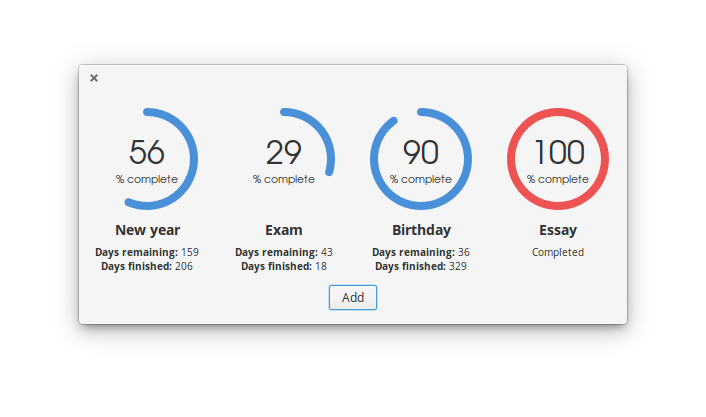

# date-countdown
A date countdown applet



## Dependencies
These dependencies must be present before building

- `valac>= 0.22`
- `meson>=0.40.1`
- `gtk+-3.0`
- `granite`

## Installation

```sh
git clone https://github.com/rickybas/date-countdown.git
cd date-countdown
meson build
cd build
ninja # or 'ninja-build' on some distributions
sudo ninja install
```
